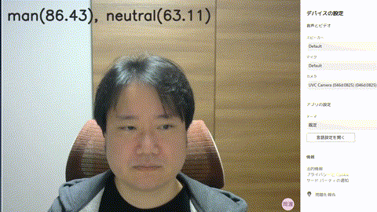

# WebCamHooker
Web link(Japanese): https://cloud.flect.co.jp/entry/2020/03/31/162537
Previous: see README.md
Next link: see README3.md

This time, I would like to extend this a little and introduce you to the challenge of analyzing emotions in real time with AI (Tensorflow).
Specifically, the system reads the emotions such as sadness and anger from the person's expression in the image, and displays a corresponding image on the screen, as shown below. Now you can communicate your feelings without saying a word in a video conference. (No, wait...)

#### Assumptions.
Take a look at previous article(see README.md) and set up v4l2loopback, etc.

#### Webcam hook extensions
In this case, it analyzes the emotions of the person captured by the camera and displays the corresponding image in the video stream.
I'll use Tensorflow for emotional analysis, but let me use the trained model at the following site, which is available under MIT license.

https://github.com/oarriaga/face_classification

First of all, please clone the script and install the necessary modules from the following repository as in the previous one.

``''
$ git clone https://github.com/dannadori/WebCamHooker.git
$ cd WebCamHooker/
$ pip3 install -r requirements.txt

``''

Next, get a pre-trained model for emotional analysis from the site just mentioned.
This time, in order to display an appropriate image, I will also make a gender judgment at the same time.
``''
$ wget https://github.com/oarriaga/face_classification/raw/master/trained_models/emotion_models/fer2013_mini_XCEPTION.110-0.65.hdf5 -P models # models for emotional analysis
$ wget https://github.com/oarriaga/face_classification/raw/master/trained_models/gender_models/simple_CNN.81-0.96.hdf5 -P models/ # models for gender determination
``''
Also, let's borrow the image from Isuratoya again.
``''
$ wget https://4.bp.blogspot.com/-8DirG_alwXo/V5Xc1SMykvI/AAAAAAAA8u4/krI2n_SWimUBGEyMWCw5kZZ-HzoUKrY8ACLcB/s800/pose_sugoi_okoru_woman.png -P images/
$ wget https://4.bp.blogspot.com/-EBpxVigkCCY/V5Xc1CHSeEI/AAAAAAAA8u0/9XIAzDJaQNU3HIiXi4PCPK3aMip3aoGyACLcB/s800/pose_sugoi_okoru_man.png -P images/

$ wget https://4.bp.blogspot.com/-HJ0FUQz67AA/XAnvUxSRsLI/AAAAAAABQnM/3XzIWzvW6L80aGB-geaHvAQETlJTAwkYQCLcBGAs/s800/business_woman2_4_think.png -P images/
$ wget https://3.bp.blogspot.com/-S7iQQCOgfWY/XAnvQWwBGtI/AAAAAAABQmc/z7yIqGjIQr88Brc_QNdOGsrJRLvqY1hcQCLcBGAs/s800/business_man2_4_think.png -P images/

$ wget https://4.bp.blogspot.com/-PQQV4wfGlNI/XAnvQBMeneI/AAAAAAABQmU/lN7zIROor9oi3q-JZOBJiKKzfklzPE1hwCLcBGAs/s800/business_man2_2_shock.png] -P images/
$ wget https://3.bp.blogspot.com/-QcDbWqQ448I/XAnvUT4TMDI/AAAAAAABQnE/_H4XzC4E93AEU2Y7fHMDBjri1drdyuAPQCLcBGAs/s800/business_woman2_2_shock.png -P images/

$ wget https://3.bp.blogspot.com/-dSPRqYvIhNk/XAnvPdvjBFI/AAAAAAABQmM/izfRBSt1U5o7eYAjdGR8NtoP4Wa1_Zn8ACLcBGAs/s800/business_man1_4_laugh.png -P images/
$ wget https://1.bp.blogspot.com/-T6AOerbFQiE/XAnvTlQvobI/AAAAAAABQm8/TYVdIfxQ5tItWgUMl5Y0w8Og_AZAJgAewCLcBGAs/s800/business_woman1_4_laugh.png -P images/

$ wget https://4.bp.blogspot.com/-Kk_Mt1gDKXI/XAnvS6AjqyI/AAAAAAABQm4/LQteQO7TFTQ-KPahPcAqXYannEArMmYfgCLcBGAs/s800/business_woman1_3_cry.png -P images/
$ wget https://4.bp.blogspot.com/-3IPT6QIOtpk/XAnvPCPuThI/AAAAAAABQmI/pIea028SBzwhwqysO49pk4NAvoqms3zxgCLcBGAs/s800/business_man1_3_cry.png -P images/

$ wget https://3.bp.blogspot.com/-FrgNPMUG0TQ/XAnvUmb85VI/AAAAAAABQnI/Y06kkP278eADiqvXH5VC0uuNxq2nnr34ACLcBGAs/s800/business_woman2_3_surprise.png -P images/
$ wget https://2.bp.blogspot.com/-i7OL88NmOW8/XAnvQacGWuI/AAAAAAABQmY/LTzN4pcnSmYLke3OSPME4cUFRrLIrPsYACLcBGAs/s800/business_man2_3_surprise.png -P images/

$ cp images/lN7zIROor9oi3q-JZOBJiKKzfklzPE1hwCLcBGAs/s800/business_man2_2_2_shock.png] images/lN7zIROor9oi3q-JZOBJiKKzfklzPE1hwCLcBGAs/s800/business_man2_2_shock.png
``''

In the above, the last command only removes the garbage (trailing brackets) in the file name.

The execution is as follows. One option has been added.

- The input_video_num should be the actual webcam device number. For /dev/video0, enter a trailing 0.
- The output_video_dev must be the device file of the virtual webcam device.
In addition, please use ctrl+c to terminate.
- emotion_mode should be true.

``''
$ python3 webcamhooker.py --input_video_num 0 --output_video_dev /dev/video2 --emotion_mode True
``''

When the above command is executed, ffmpeg starts to run and the video is delivered to the virtual camera device.

#### Let's do a video conference!
As before, when you have a video conference, you should see something called "dummy~" in the list of video devices, so select it.
This is an example of Teams. The text at the top of the screen changes according to the expression, and the corresponding image is displayed accordingly. It was a great success.

#### Finally.
It may be difficult to communicate casually when you work from home for a long time, but I think it's a good idea to bring this kind of playfulness to video conferencing to liven up the conversation.
I'm sure you can do a lot more, so please try it out.

#### Reference.
I referred to the following site to learn more about emotional analysis using Tensorflow.
(In this site, it is introduced by tensorflowjs)

https://book.mynavi.jp/manatee/detail/id=99887.

